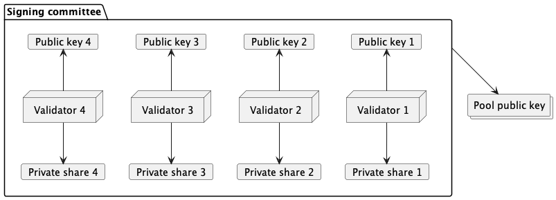
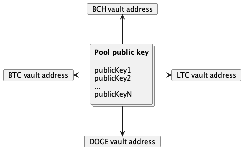
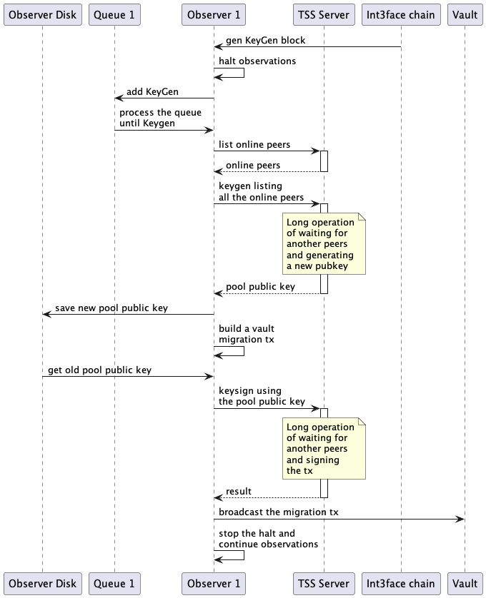

# ADR-002: Dynamic Committee

## Status

Done

## Context

### Validator committee

Several validators, acting as observers, form the signing committee. The purpose of this committee is to represent the vault owner across multiple external chains, eliminating a single point of failure through its distributed nature. Each member of the committee possesses a private share used during the signing process. Along with that, the committee has its public key. The public key is used to verify the signature is the same public key that corresponds to the original signing committee. This public key is known to everyone who needs to verify the signatures and is derived during the initial setup of the scheme.



### Pool public key

In a Threshold Signature Scheme (TSS), generating the public key without any single participant knowing the full private key involves a collaborative process during the initial setup phase. This public key, known as the **pool public key**, represents the entire committee and is used to verify signatures generated by the committee. The pool public key encapsulates information about all members of the committee and is sensitive to changes in the committee’s composition. Essentially, the pool public key is a composite of all the public keys of the validators in the committee. Therefore, if the participants in the committee change, the current pool public key will no longer accurately represent the new committee and must be regenerated.

Essentially, the pool public key is a cryptographic public key that can be represented as the address associated with any blockchain that uses public keys as addresses. This ensures that the committee is recognized as the owner of the vault operating across different chains.




### Validator rotation

The validator committee is called **dynamic** because it supports runtime **validator rotation**. **Validator rotation** is a mechanism that allows new validators to join or exit the committee. With each committee modification, the pool public key must be regenerated to reflect the new participants. Consequently, every modification changes the all vault addresses on all the external chains. Handling this process, known as **vault migration**, involves moving funds from the old vault to the new one. It typically takes a few hours to complete. Users are instructed to only send funds to the newest vault, but the retiring vault is monitored. Once the last of the vault migrations is complete, the previous vault is discarded and no longer monitored.

Validator rotation is triggered by a governance proposal. The proposal specifies the block height at which the rotation must occur and the expected timeout for all validators to join the new committee (e.g., 1 hour).

## Accepted approach

1. Create a special block type: KeyGen block.
2. Submit this block only through a governance proposal.
3. The KeyGen block indicates that starting from this block, the committee should generate a new pool public key and start using it.
4. The observer detects this block.
5. The observer halts all observations.
6. The observer adds the KeyGen block to the end of the queue and focuses on finishing the current queue.
7. When it is the KeyGen block's turn, the observer sends the key generation request, listing all currently online peers.
8. The observer waits for a new party to form within a specified timeout (usually around an hour).
9. Once the party is formed, it generates a new key and stores it in memory.
10. After the key is generated, the observer initiates the vault migration process.
11. The vault migration involves a TSS-signed transfer of all tokens from the old vault to the new one. This transfer should be signed using the old pool public key.
12. Once the transfer is complete, the observer sets the new key as active, stops the halt, and continues observing from the next block.



### MsgKeyGen

```protobuf
message MsgKeyGen {
  // Do we need to include anything there?
}

message MsgKeyGenResponse {}
```

## Alternative approaches

### Static committee
Generate all keys manually and distribute them.

Pros:
* Don’t disturb vals with the simultaneous generation
* The val setup process is simple: just copy several files
* Easy to achieve: don’t require any coding

Cons:
* Totally insecure: sb except for the val knows its private key
* We can start the signing only when all vals join
* The vault migration requires generating and distributing keys once again

## Steps to implement

1. Add the `MsgKeyGen` Int3face handler: proto contract and MsgServerCreate a special block type: KeyGen block [40](https://github.com/Int3facechain/bridge/issues/40).
2. Add `MsgKeyGen` witnessing in the Int3face chain client [41](https://github.com/Int3facechain/bridge/issues/41).
3. Implement observer halting [42](https://github.com/Int3facechain/bridge/issues/42).
4. Add the `MsgKeyGen` observer handler [43](https://github.com/Int3facechain/bridge/issues/43).
5. Add vault migration mechanism in the observer [44](https://github.com/Int3facechain/bridge/issues/44).

## Corner cases

1. If the keygen fails for any reason, abort the process and continue observing using the old pool public key.

## Consequences

1. Who needs to pay the fees for the vault migration? We can't pay them from the vault balance, as it leads to a difference in iBTC total supply and vault supply.
2. Do we really need to halt observations? It seems nothing will happen if we just continue.
3. Do we need to store all successful outbound transfers in the state so that observers might check that the transfer has already been executed?

## References

1. [Validator rotation presentation](../validators/validator-rotation.pdf).
2. [Dynamic committee corner cases presentation](../validators/dynamic-committee-corner-cases.pdf).
3. 