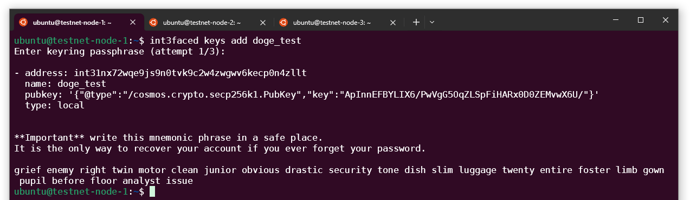
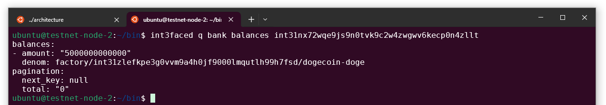
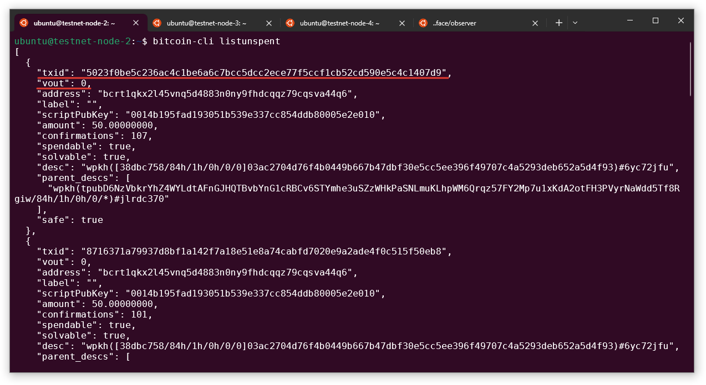
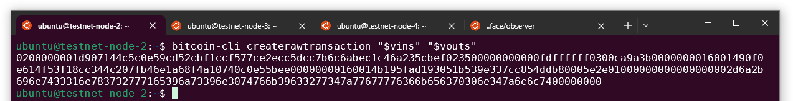
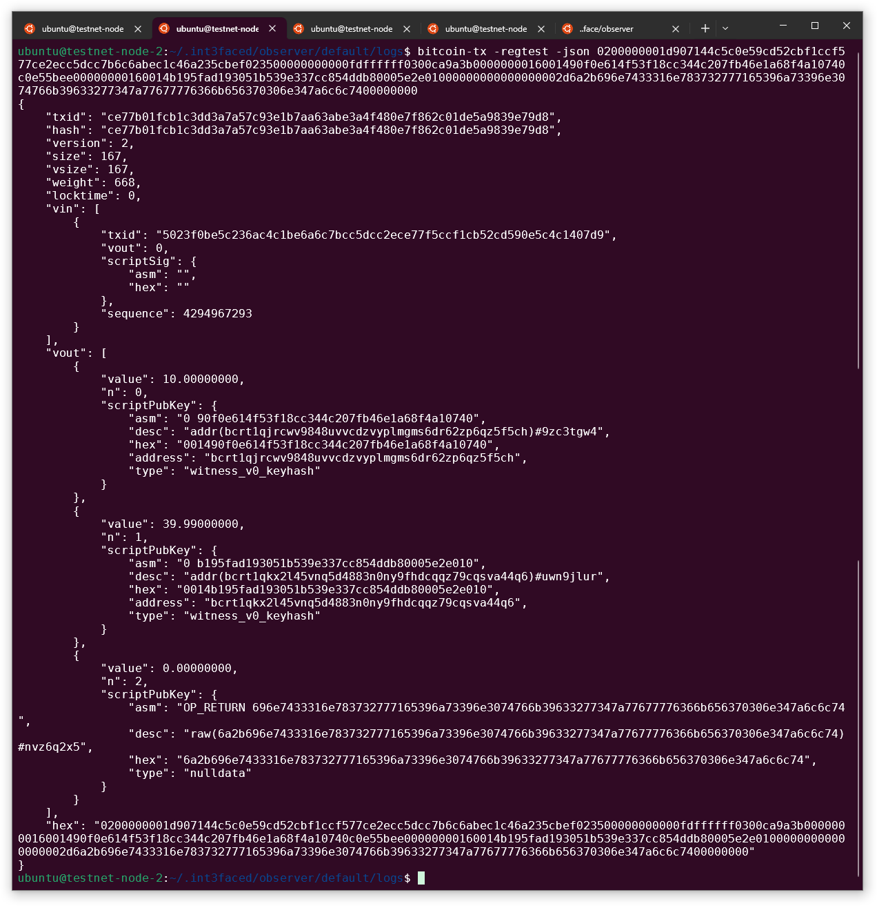
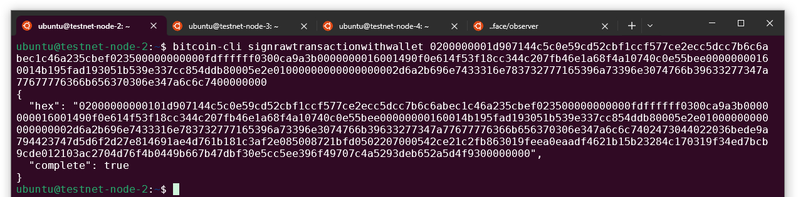
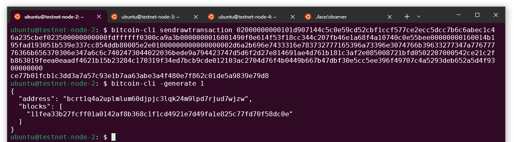
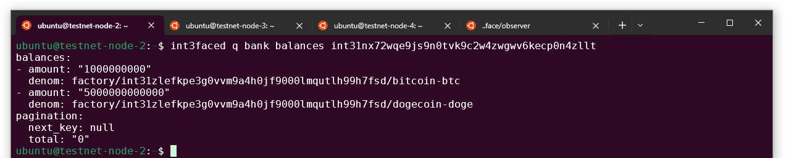
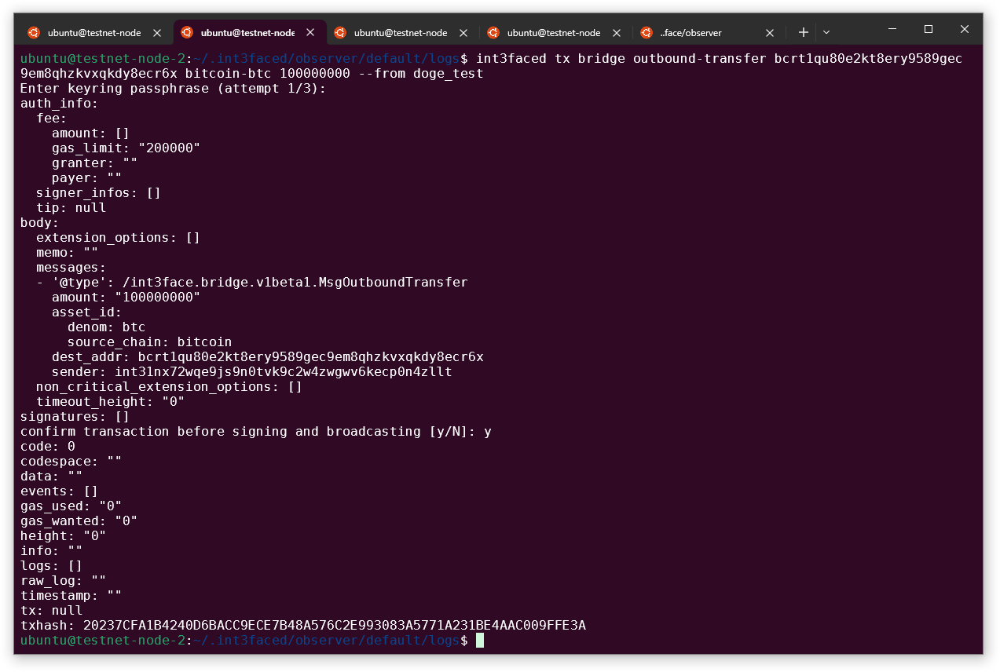
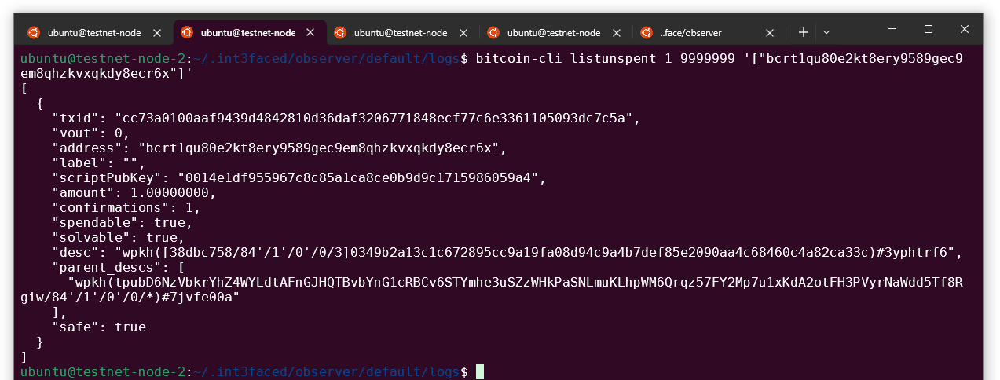

# BTC Demo

This is the demo for the inbound and outbound transfer flow in the Int3face for BTC tokens.

**Requirements**
1. Int3face node
2. Int3face observer (configured for the BTC regtest)
3. [BTC regtest node](../../int3face/build-and-run/btc_deploy.md)

We have everything deployed and ready in the Int3face testnet. Request Int3face team to get access to the testnet environment.

Current Bitcoin vault address: `bcrt1qjrcwv9848uvvcdzvyplmgms6dr62zp6qz5f5ch`

## Inbound Transfer

We will use our own BTC validator funds.

1. We need an int3 address to send funds to

We can generate new address by `int3faced keys add "$your_key_name"`.


We will use the address `int31nx72wqe9js9n0tvk9c2w4zwgwv6kecp0n4zllt`

2. Lets verify that this address doesn't have DOGE tokens in the Int3face

```sh
int3faced q bank balances int31nx72wqe9js9n0tvk9c2w4zwgwv6kecp0n4zllt
```



3. Select an UTXO to spend

```sh
bitcoin-cli listunspent
```



If you don't see any UTXO available, mine a block to receive the rewards `bitcoin-cli -generate 1`, and run `listunspent` command again.

4. Build raw transaction from the UTXO you selected

**Vins**
   * Take the `txid` and `vout` from the UTXO you're going to spend

**Vouts**
   * Add the DOGE vault address and the amount to send
   * Add the change address to get remaining tokens back (to get address of your current node run `bitcoin-cli listreceivedbyaddress 0 true`)
   * Leave a small amount of tokens to pay the fee (0.1 should be enough)
   * Add `data` entry with the hex encoded recipient address
     * Encode `int31nx72wqe9js9n0tvk9c2w4zwgwv6kecp0n4zllt` at the (online converter)[https://www.rapidtables.com/convert/number/ascii-to-hex.html]

```sh
vins='[
    {
        "txid": "5023f0be5c236ac4c1be6a6c7bcc5dcc2ece77f5ccf1cb52cd590e5c4c1407d9",
        "vout": 0
    }
]'

vouts='{
    "bcrt1qjrcwv9848uvvcdzvyplmgms6dr62zp6qz5f5ch": 10.0,
    "bcrt1qkx2l45vnq5d4883n0ny9fhdcqqz79cqsva44q6": 39.99,
    "data": "696E7433316E783732777165396A73396E3074766B39633277347A77677776366B656370306E347A6C6C74"
}'

bitcoin-cli createrawtransaction "$vins" "$vouts"
```



5. We can verify that the transaction is correct

```sh
bitcoin-tx -regtest -json "$raw_tx"
```



6. Sign the transaction

```sh
bitcoin-cli signrawtransactionwithwallet $raw_tx
```



7. Broadcast signed transaction to the BTC

```sh
bitcoin-cli sendrawtransaction $signed_tx
```



8. Generate a block to include our transaction in the chain

```sh
bitcoin-cli -generate 1
```

Now the transaction should be observed by the Observer and sent to the Int3face chain.

9. Check your balance on the Int3face chain.

```sh
int3faced q bank balances int31nx72wqe9js9n0tvk9c2w4zwgwv6kecp0n4zllt
```


Now, we can see BTC tokens in our wallet.

## Outbound Transfer

Lets send some of the tokens back from Int3face to BTC.

1. Generate new BTC address

```sh
bitcoin-cli getnewaddress
bcrt1qu80e2kt8ery9589gec9em8qhzkvxqkdy8ecr6x
```

2. Request an outbound transfer from the bridge module

```sh
int3faced tx bridge outbound-transfer bcrt1qu80e2kt8ery9589gec9em8qhzkvxqkdy8ecr6x bitcoin-btc 100000000 --from doge_test
```



3. We can check our balance again to see that DOGE tokens in Int3face were burt

```sh
int3faced q bank balances int31nx72wqe9js9n0tvk9c2w4zwgwv6kecp0n4zllt
```

4. Generate a block in BTC to include transaction from the vault

```sh
bitcoin-cli -generate 1
```

5. Check DOGE balance of the address we created before

```sh
bitcoin-cli listunspent 1 9999999 '["bcrt1qu80e2kt8ery9589gec9em8qhzkvxqkdy8ecr6x"]'
```


Now, we can see BTC tokens in our wallet.